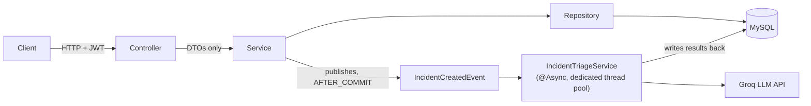

<div align="center">

# AI-Powered Incident Management Platform

A backend service for reporting, tracking, and resolving operational incidents —
a lightweight internal Jira/PagerDuty for engineering teams — with an LLM in the
loop to automatically triage every incident the moment it's reported.

[](https://openjdk.org/)
[](https://spring.io/projects/spring-boot)
[](https://www.mysql.com/)
[](https://www.docker.com/)
[](.github/workflows/ci.yml)
[](#license)

[Features](#features) • [Tech Stack](#tech-stack) • [Architecture](#architecture) • [Getting Started](#getting-started) • [API Reference](#api-reference) • [Testing](#testing)

</div>

---

## Overview

Most fresher-level CRUD projects stop at "create/read/update/delete + login." This one goes a
step further, aiming to behave like something that would survive a code review at a real
company — proper API boundaries, role-based authorization, an audit trail, and async
processing done correctly, all backed by a test suite that runs with zero external setup.

## Features

**Auth & access control**
- JWT-based login and registration (stateless, no server-side sessions)
- Three roles — `ADMIN`, `ENGINEER`, `EMPLOYEE` — enforced per-endpoint
- BCrypt password hashing; login failures never reveal whether an email is registered

**Incident lifecycle**
- Create, view, filter, and paginate incidents by status and severity
- Ownership (`reportedBy`) and assignment (`assignedTo`) to a specific engineer
- Status workflow: `OPEN → IN_PROGRESS → RESOLVED → CLOSED`
- Full audit trail of every status change, assignment, comment, and AI event
- Optimistic locking so concurrent updates to the same incident can't silently overwrite each other

**AI-powered triage**
- Every new incident is automatically analyzed by an LLM (Groq) for category, severity, and a
  recommended next step — see [Architecture](#architecture) for how this runs without ever
  slowing down the API
- Graceful fallback to a safe default if the AI call fails, times out, or returns malformed output

**Collaboration & visibility**
- Threaded comments per incident
- Dashboard endpoint for incident counts by status and severity
- Swagger / OpenAPI docs generated automatically from the code

**Engineering hygiene**
- Centralized exception handling with correct HTTP status codes (no stray 500s on bad input)
- DTOs on the wire, never raw JPA entities — see [Architecture](#architecture)
- Structured logging, timeouts on the external AI call, no secrets committed to source
- Unit, repository, and context-load tests running in CI on every push — see [Testing](#testing)
- One-command local setup via Docker Compose

## Tech stack

| Layer         | Choice                                                 |
|---------------|---------------------------------------------------------|
| Language      | Java 17                                                  |
| Framework     | Spring Boot 3.5 (Web, Security, Data JPA, Validation)    |
| Database      | MySQL (H2 in-memory for tests)                           |
| Auth          | JWT (`jjwt`), BCrypt password hashing                    |
| AI            | Groq API (Llama 3.1), via `RestTemplate` with timeouts   |
| API docs      | springdoc-openapi (Swagger UI)                           |
| Build / CI    | Maven, GitHub Actions                                    |
| Container     | Docker, Docker Compose                                   |

## Architecture



**Layering.** Controllers only translate HTTP ↔ DTOs and enforce role checks; they contain no
business logic. Services own transactions and business rules. A dedicated mapper sits between
entities and DTOs, so the API response shape is a deliberate contract rather than whatever JPA
happens to expose — this also means lazy associations can never leak into a response and trigger
a `LazyInitializationException`.

**Async AI triage.** Incident creation publishes an `IncidentCreatedEvent` rather than calling
the AI service directly. A listener picks it up with
`@TransactionalEventListener(phase = AFTER_COMMIT)` and runs it `@Async` on its own thread pool.
This does two things at once: the API responds immediately without waiting on a third-party LLM
call, and the listener is guaranteed to only run after the incident row is actually committed —
calling an `@Async` method directly from inside the creating transaction would risk the triage
thread reading a row that isn't visible yet.

## Getting started

### Option 1 — Docker (recommended)

```bash
git clone <this-repo>
cd ai-incident-management-platform
cp .env.example .env      # optionally add a free Groq API key
docker compose up --build
```

The API is now live at `http://localhost:8080`, with Swagger UI at
`http://localhost:8080/swagger-ui/index.html`.

### Option 2 — Run locally

Requires Java 17 and a running MySQL instance.

```bash
cp .env.example .env
# edit .env with your local MySQL credentials
export $(cat .env | xargs)   # or use your IDE's env-file support
./mvnw spring-boot:run
```

## Configuration

All configuration is externalized via environment variables (see `.env.example`) — nothing
sensitive is hardcoded or committed.

| Variable            | Purpose                     | Default (dev)                                                                     |
|---------------------|-------------------------------|--------------------------------------------------------------------------------------|
| `DB_URL`            | MySQL JDBC URL               | `jdbc:mysql://localhost:3306/incident_management?useSSL=false&allowPublicKeyRetrieval=true&serverTimezone=UTC` |
| `DB_USERNAME`       | MySQL username                | `root`                                                                                 |
| `DB_PASSWORD`       | MySQL password                | `root`                                                                                 |
| `JWT_SECRET`        | HMAC signing key for JWTs     | *(must be overridden before deploying)*                                               |
| `JWT_EXPIRATION_MS` | Token lifetime in ms          | `86400000` (24h)                                                                       |
| `GROQ_API_KEY`      | API key for AI triage         | *(blank — AI triage falls back to a safe default)*                                    |
| `GROQ_MODEL`        | Groq model name               | `llama-3.1-8b-instant`                                                                 |

## API reference

Full interactive documentation is available at `/swagger-ui/index.html` once the app is running.

<details>
<summary><strong>Auth</strong></summary>

| Method | Endpoint              | Access         | Description             |
|--------|-------------------------|----------------|----------------------------|
| POST   | `/api/auth/register`    | Public         | Create an account          |
| POST   | `/api/auth/login`       | Public         | Obtain a JWT                |
| GET    | `/api/auth/me`          | Authenticated  | Current user's profile     |

</details>

<details>
<summary><strong>Incidents</strong></summary>

| Method | Endpoint                       | Access                     | Description                       |
|--------|----------------------------------|----------------------------|--------------------------------------|
| POST   | `/api/incidents`                | ADMIN, EMPLOYEE            | Report an incident                   |
| GET    | `/api/incidents`                | ADMIN, ENGINEER, EMPLOYEE  | List incidents (filter + paginate)   |
| GET    | `/api/incidents/my`             | ADMIN, ENGINEER, EMPLOYEE  | Incidents I reported                 |
| GET    | `/api/incidents/{id}`           | ADMIN, ENGINEER, EMPLOYEE  | Incident detail                      |
| GET    | `/api/incidents/{id}/activity`  | ADMIN, ENGINEER, EMPLOYEE  | Full audit trail for an incident     |
| PUT    | `/api/incidents/{id}/status`    | ADMIN, ENGINEER            | Change status                        |
| PUT    | `/api/incidents/{id}/assign`    | ADMIN, ENGINEER            | Assign to an engineer                |
| DELETE | `/api/incidents/{id}`           | ADMIN                      | Delete an incident                   |

</details>

<details>
<summary><strong>Comments, AI & dashboard</strong></summary>

| Method | Endpoint                       | Access                     | Description                         |
|--------|----------------------------------|----------------------------|----------------------------------------|
| POST   | `/api/incidents/{id}/comments`  | ADMIN, ENGINEER, EMPLOYEE  | Add a comment                          |
| GET    | `/api/incidents/{id}/comments`  | ADMIN, ENGINEER, EMPLOYEE  | List comments                          |
| POST   | `/api/ai/analyze`               | Authenticated              | Manually run AI triage on any text     |
| GET    | `/api/dashboard/stats`          | ADMIN, ENGINEER, EMPLOYEE  | Incident counts by status/severity     |

</details>

## Testing

```bash
./mvnw test
```

Tests run entirely against an in-memory H2 database, so no MySQL instance, Docker, or network
access is needed — locally or in CI.

| Test                                  | Type              | Covers                                                       |
|-----------------------------------------|-------------------|-----------------------------------------------------------------|
| `AuthServiceImplTest`                   | Unit (Mockito)    | Register, login success/failure, credential-leak prevention     |
| `IncidentServiceImplTest`               | Unit (Mockito)    | Creation, event publishing, status transitions                   |
| `JwtServiceTest`                        | Unit              | Token generation, validation, expiry                              |
| `IncidentRepositoryTest`                | `@DataJpaTest`    | Dynamic `Specification` filters, pagination, ownership scoping    |
| `IncidentManagementApplicationTests`    | `@SpringBootTest` | Full application context loads end to end                        |

## Roadmap

Documented here rather than half-implemented, since a project is judged as much on knowing
what's *not* done as on what is:

- Refresh tokens / token revocation (JWTs currently just expire)
- Flyway/Liquibase migrations in place of `ddl-auto`
- Rate limiting on `/api/auth/login`
- WebSocket/SSE push for live incident updates
- A minimal frontend (currently API-only, driven via Swagger or Postman)

## License

MIT — feel free to use this as a reference for your own projects.
